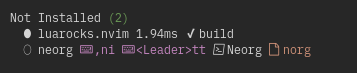
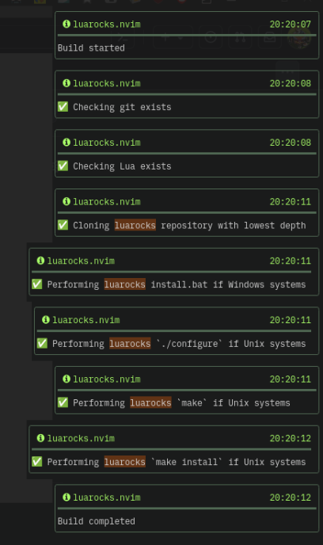
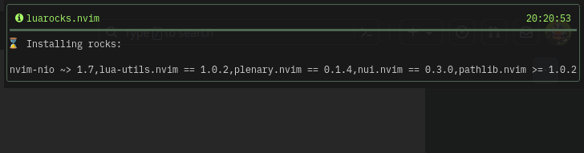
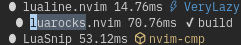
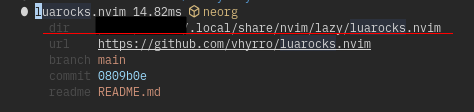

# Introduction

I assume you are reading this article because neorg did not setup correctly with the recommended setup provided by [Vhyrro's article](https://vhyrro.github.io/posts/neorg-and-luarocks).

If you haven't seen this article yet, read that. This article is aimed to troubleshoot people who already tried all options listed there.

Also this article is not perfect. If you manage to solve the problem in a way that's not written here, please consider making a PR to enrich this document.

# Troubleshooting

Please do not run commands that are not listed here between the sections. Some commands may generate cache and will not behave the same on the second execution, which might lead to worse situations. So, let's get going. Be prepared, this is not a short journey.

## No Errors on Startup but Highlights won't Load

Try to run `:=require("lua-utils")`.

If you see a wall of errors, build process did not run successfully. So basically you do not have `luarocks.nvim` / `neorg` installed correctly no matter what you think.

Follow all instructions I provide including [Uninstall `luarocks.nvim` / `neorg`](#uninstall-luarocksnvim--neorg).

If you follow all instructions and still cannot make it to work, please visit [Discord]($/norg_tutorial.norg#discord).

## Termux Users

Out of luck. Luarocks cannot be executed due to weird system configuration. Stick to neorg v7.

When neorg v9 is out, there will be a better treesitter parser (v3) and a mobile app for editing neorg is being developed with this parser. So you might not need termux at all?

## Install System Dependencies

Install the system dependencies based on your distribution.

- `sudo dnf install compat-lua-devel-5.1.5`: [comment](https://github.com/nvim-neorg/neorg/issues/1342#issuecomment-2017167912)
- `sudo pacman -Syu luajit` or `lua51`: [comment](https://github.com/nvim-neorg/neorg/issues/1342#issuecomment-2017814358)
- `sudo apt install liblua5.1-0-dev`: [comment](https://github.com/nvim-neorg/neorg/issues/1342#issuecomment-2017728318)
- Brew: PR required
- NixOS: PR required
  - I think work has been done to make a flake of luarocks.nvim+neorg but I might be wrong.
- Termux: unavailable. See [Termux Users](#termux-users).

Do not forget to update your system as well. Up to date system is always better regardless of my advice here.

## Delete `build =` Flag

If you have `build = ":Neorg sync-parsers",` in your lazy spec, delete that line. Run `:Lazy build neorg`. You might see everything working now.

Be careful if you are an AstroNvim user, this is set by default and there's not much you can do right now. It will be fixed soon so wait patiently.

- <https://github.com/AstroNvim/astrocommunity/pull/813>

## Uninstall `luarocks.nvim` / `neorg`

Open the lazy UI (`:Lazy`) and move your cursor to `luarocks.nvim`. Press `x` (lower `x`) to uninstall this single plugin. Do this again for `neorg`.



## Restart Neovim

Exit neovim and restart. You should see the lazy UI automatically starting and the installation of both plugins should start.

If you don't see the UI, set `config.install.missing = true` for lazy's config (this is the default value).

If you see these notifications and all tasks ran successfully, you are good to go. \* You might not see `pathlib.nvim >= 1.0.2` in the second image; that's OK.

If you missed them, you can see the list with `:Notifications` or `:messages`.

 

If you don't see those notifications, try running these two commands.

- `:Lazy build luarocks.nvim`
- `:Lazy build neorg`

Go to [Build Task Failed](#build-task-failed) if you see any of the tasks fail.

If you still don't see the notifications and there is no checkmark next to the two plugins like this, please try...



1.  Open lazy UI: `:Lazy`.
2.  Search `luarocks.nvim`.
3.  Press `<CR>` (enter).
4.  You should see information of the installed plugin.
5.  Remember the path shown with `dir:`
6.  Run `:source <dir-path>/build.lua`
    1.  For example in my case, I will run `:source ~/.local/share/nvim/lazy/luarocks.nvim/build.lua`.

 If you successfully see the notifications, rerun the same process for neorg as well.

## Build Task Failed

Read this section if any of the tasks report fail.

### No Notifications at All

#### a) Install nvim-notify

This should be an optional dependency but installation process might not work without this plugin. Please install [nvim-notify](https://github.com/rcarriga/nvim-notify) via lazy.nvim and try again.

#### B) You Already Have Luarocks Installed

Check if you already have `<luarocks.nvim-install-dir>/.rocks/bin/luarocks`. (i.e. `~/.local/share/nvim/lazy/luarocks.nvim/.rocks/bin/luarocks`)

You must have not followed the instructions somewhere. Good luck on your own.

### Cloning luarocks repository with lowest depth

The clone destination already exists. You must have not followed the instructions somewhere. Good luck on your own.

### Performing luarocks `./configure` if Unix systems

Most likely luarocks could not find lua header files (`lua.h`) in your system. Make sure you followed [Install System Dependencies](#install-system-dependencies) or this should not happen.

Run `locate lua.h` and find the most relevant file. Pass the dirname to `luarocks_build_args` as below.

If you are on NixOS, a workaround is (ofc change the path to match your system)

``` lua
{
  "vhyrro/luarocks.nvim",
  opts = {
    luarocks_build_args = {
      "--with-lua-include=/nix/store/98blcb69q9qy0k279xjk10lcmfwnd4rg-luajit-2.1.1693350652/include",
    },
  },
}
```

### Performing luarocks `make` if Unix systems

Umm, you probably did something wrong. Ask it on [Discord]($/norg_tutorial.norg#discord).

### Performing luarocks `make install` if Unix systems

Umm, you probably did something wrong. Ask it on [Discord]($/norg_tutorial.norg#discord).

## Update Dependencies

With your favorite package manager, uninstall `wget` and reinstall.

`sudo apt uninstall wget && sudo apt update && sudo apt install wget`.

## `nvim-treesitter` Does Not Load

``` lua
{
  "nvim-neorg/neorg",
  dependencies = { "luarocks.nvim", "nvim-treesitter" }, -- Add nvim-treesitter here
  config = function()
  ...
}
```
